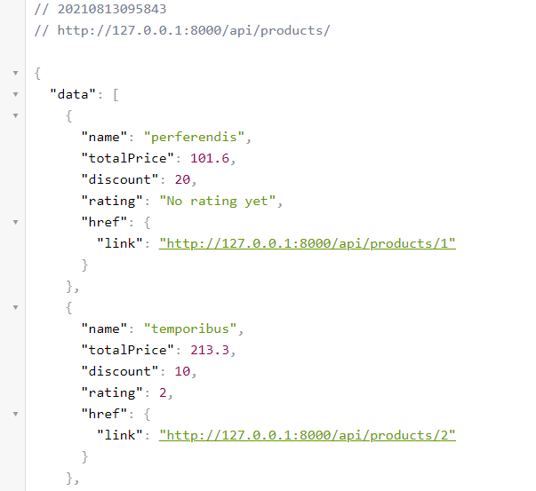
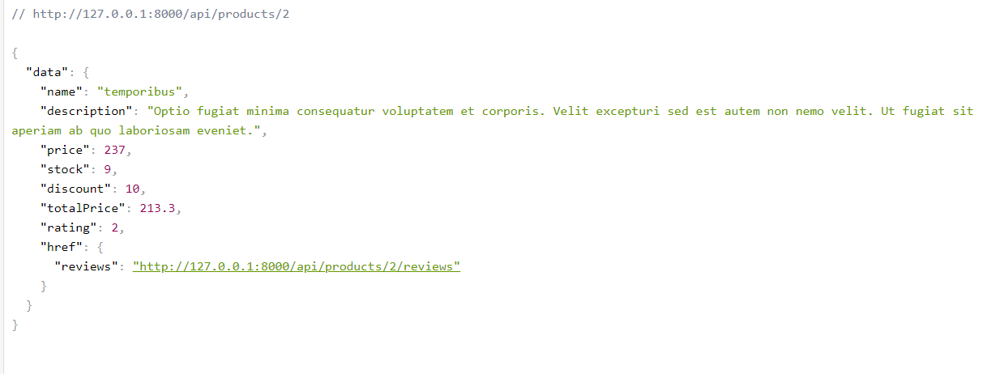
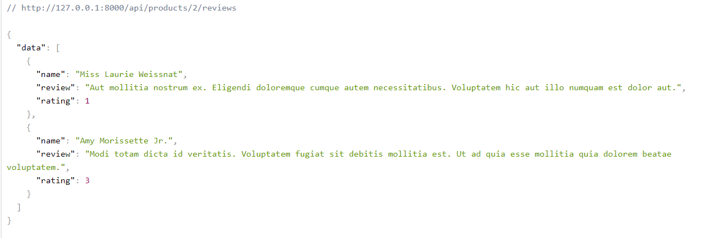

<h2>Ecommerce REST API</h2>

A simple ecommerce API to fetch products and get reviews on each products. 

Laravel was use in this project because is a comprehensive framework suitable for any kind of web development, is logically structured, and enjoys strong community support.</>

<h2>How to use the API</h2>

<ul>
<li>To get all products   "/api/products/"</li>  

<li>Fetch single products   "/api/products/id" /li>

<li>Fetch a product reviews.    "/api/products/id/reviews" </li>   

</ul>
